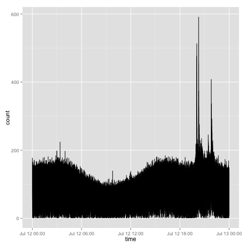

## First Steps - Task 1

First we started with:

1. Looking at the Data
2. Decided to work with R
3. Find we need a preprocessing we couldn't do within R
4. Write a small programm reading and cleaning the raw dat in .NET Framework


---
## Data Cleaning

```{}
Dim sr As StreamReader = New StreamReader(inputpath + file)
Dim sw As StreamWriter = New StreamWriter(outputpath + file)

'Read every line
Dim line As String
line = sr.ReadLine()
```

---
## Data in R
Load and save Data

```r
dat_twelve <- fread('numeric_20140712.csv',header=F,sep=';')
saveRDS("numeric_20140712.Rda")
dat <- readRDS(file="numeric_20140712.Rda")
```


---

## Working on the Data

```r
count  <- data.frame(table(dat$V3))
count$Var1[1:5]
```


```r
sumMinute <- c()
for(i in seq(1,length(count$Freq),60)){sumMinute <- append(sumMinute,sum(count$Freq[i:(i+60)]))}
sumHour <- c()
for(k in seq(1,length(count$Freq),3600)){sumHour <- append(sumHour,sum(count$Freq[k:(k+3600)]))}
realTime <- strptime(as.character(count$Var1),format="%Y%m%d%H%M%S")
Tweet.count <- count$Freq
```


---
## Plot the Data

```r
df <- data.frame(realTime,Tweet.count)
ggplot(df,aes(x=realTime,y=Tweet.count)) + geom_line()
```

```r
ggplot(dat1,aes(x=time,y=count)) + geom_line()
```

 

---
## Tweets per Second - Minute - Hour
Plot wiht different time resolutions

   

---
## Tweets per Day
Plots for July the 12th - 13th - 14 | Tweets per minute

   
